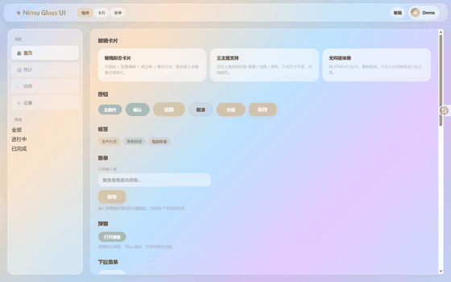
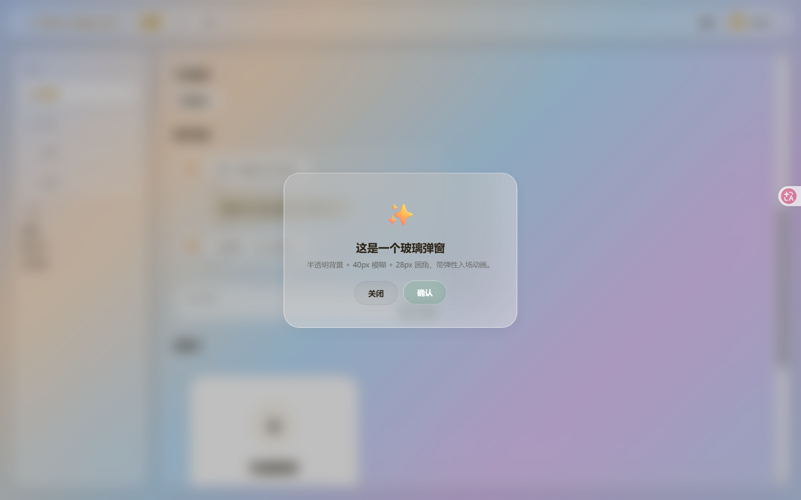
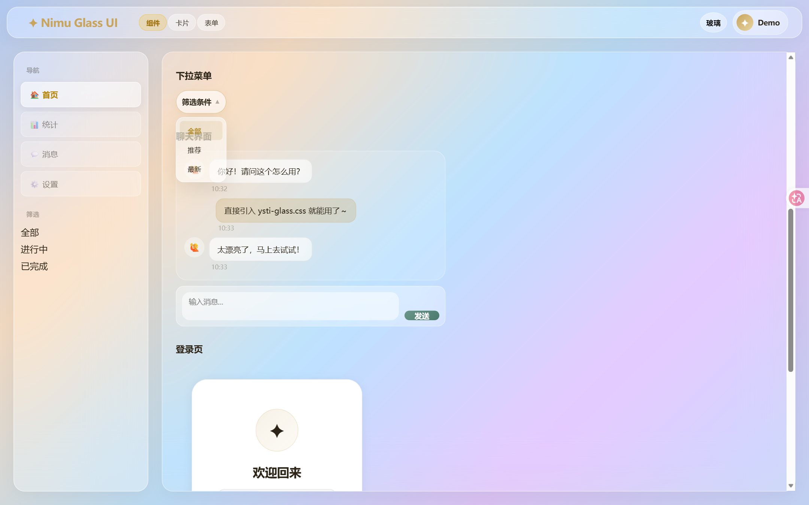
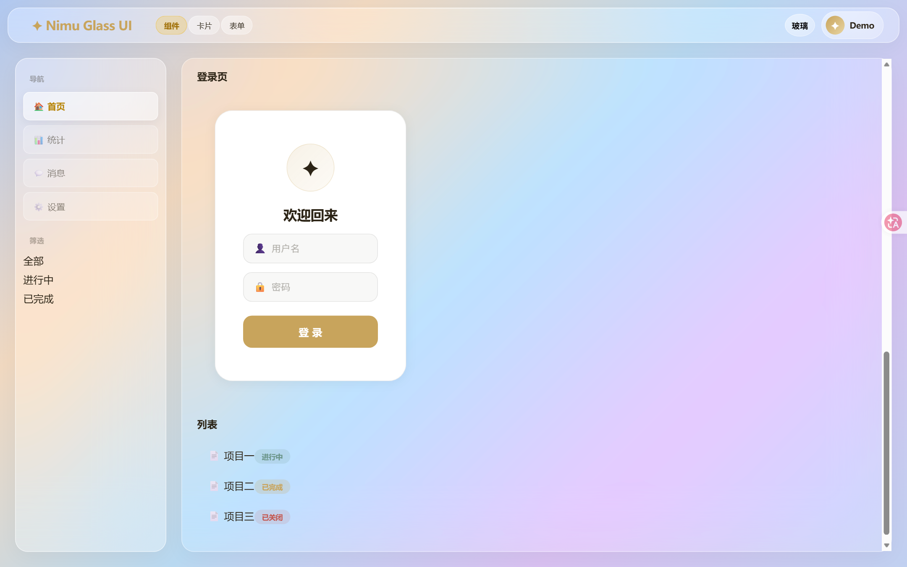
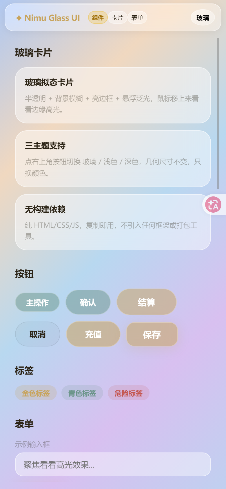

<div align="center">

# ✦ YSTI Glass UI

**一套精致的「三主题玻璃拟态」Web UI 体系**

纯 HTML / CSS / JS · 零构建依赖 · 复制即用

</div>

---

## 是什么

YSTI Glass UI 是一套**完整的 Web UI 体系**：玻璃拟态（Glassmorphism）+ 浅色 + 深色三主题一键切换，附带液态玻璃背景、光标泛光、玻璃边缘高光等特效。

它不是一个框架，而是一份**开箱即用的设计资产**：把 `ysti-glass.css` 引入你的页面，就能获得一整套打磨过的组件视觉——卡片、按钮、表单、弹窗、导航、侧边栏、登录页、消息气泡，全部自带三主题适配。

## 截图

| 玻璃拟态（默认） | 浅色 | 深色 |
|---|---|---|
|  |  |  |

🎬 **三主题切换动效**：

**组件特写**（弹窗 / 下拉菜单 / 聊天界面）：

| | | |
|---|---|---|
|  |  |  |

📱 **移动端 H5**：

## 特性

- ✨ **三主题体系**：玻璃拟态（默认）/ 浅色 / 深色，一键切换，几何尺寸恒定、只换颜色
- 🧊 **真·玻璃拟态**：半透明 + `backdrop-filter` 背景模糊 + 亮色描边 + 悬浮泛光
- 🎨 **液态玻璃背景**：`liquid-glass.js` — WebGL2 动态玻璃色块，鼠标跟随光晕（可关闭）
- 💫 **光标泛光 + 边缘高光**：鼠标经过玻璃板时边缘泛起高光（可关闭）
- 📱 **响应式**：桌面 / 移动端（≤820px）自适应，支持 `safe-area` 刘海屏
- 🚫 **零依赖**：不引入任何框架、UI 库、构建工具，纯原生三件套
- 🧩 **组件齐全**：卡片、按钮、标签、表单、弹窗、导航、侧边栏、登录页、聊天界面

## 在线演示

👉 [https://ystibdjmnm.github.io/ysti-glass-ui/](https://ystibdjmnm.github.io/ysti-glass-ui/)（GitHub Pages，配置方法见文末）

## 快速开始

### 方式一：直接看演示

```bash
# 任意静态服务器打开 index.html 即可（或直接双击）
python -m http.server 8080
# 浏览器访问 http://localhost:8080
```

点右上角按钮切换三主题；鼠标划过卡片看边缘高光；演示页包含卡片、按钮、标签、表单、弹窗、下拉菜单、聊天界面、登录页、列表等全部组件。

### 方式二：引入到你的项目

**方法 A：CDN 一行引入（推荐，无需下载）**

```html
<link rel="stylesheet" href="https://cdn.jsdelivr.net/gh/ystibdjmnm/ysti-glass-ui@main/assets/ysti-glass.css">
<!-- 可选：液态玻璃背景特效 -->
<script src="https://cdn.jsdelivr.net/gh/ystibdjmnm/ysti-glass-ui@main/assets/liquid-glass.js"></script>
```

**方法 B：下载到本地**

把 `assets/ysti-glass.css` 复制到你的项目，然后：

```html
<link rel="stylesheet" href="ysti-glass.css">
```

**最简可运行示例**（保存为 html 打开即可看到效果）：

```html
<!DOCTYPE html>
<html lang="zh-CN">
<head>
<meta charset="UTF-8">
<title>我的页面</title>
<link rel="stylesheet" href="ysti-glass.css">
</head>
<body>
  <div class="order-card" style="max-width:380px;margin:48px auto;padding:26px">
    <h3>我的玻璃卡片</h3>
    <p style="color:var(--text-dim)">引入 ysti-glass.css 即可使用全部组件</p>
    <div style="display:flex;gap:10px;margin-top:14px">
      <button class="btn-accept">主操作</button>
      <button class="btn-cancel">取消</button>
    </div>
  </div>
  <!-- 试试加 <body class="dark-mode"> 看深色主题 -->
</body>
</html>
```

不需要任何初始化代码，样式开箱即用。

### 三主题切换

```html
<!-- 玻璃拟态（默认，无需类名） -->

<!-- 浅色 -->
<body class="light-mode">

<!-- 深色 -->
<body class="dark-mode">
```

主题按钮 + 持久化（localStorage）参考 `index.html` 末尾的 `themeToggle` 示例：

```js
var theme = localStorage.getItem("ysti_theme") || "glass";
// glass → light → dark 循环切换，写入 body class 与 localStorage
```

## 组件清单

| 组件 | 类名 | 说明 |
|---|---|---|
| 玻璃卡片 | `.order-card` | 通用玻璃卡片，hover 泛光 |
| 主按钮 | `.btn-accept` `.btn-confirm` `.btn-checkout` `.btn-save` | 金色/青色渐变 |
| 次按钮 | `.btn-cancel` | 轻量按钮 |
| 登录页 | `.login-overlay` `.login-panel` `.login-field` `.login-btn` | 完整登录卡片 |
| 弹窗 | `.modal-overlay` `.modal-panel` | 28px 圆角玻璃弹窗 |
| 表单 | `.form-group` `.form-row` | 输入/文本域/选择 |
| 下拉菜单 | `.filter-dropdown-trigger` `.filter-dropdown-menu` `.filter-dropdown-item` | 点击展开 |
| 聊天界面 | `.chat-msg` `.chat-input-area` | 消息气泡 + 输入区 |
| 顶栏 | `.topbar` `.topbar-logo` `.topbar-nav-btn` `.icon-btn` | 导航栏 |
| 侧边栏 | `.sidebar` `.sidebar-title` `.game-btn` `.oc-filter-btn` | 导航/筛选 |
| 主内容 | `.main-content` | 玻璃面板容器 |
| 标签/徽章 | 自定义 + `--accent/--teal/--danger` 色值 | 胶囊样式 |
| 搜索栏 | `.search-bar` `.search-input` `.search-btn` | |
| 列表行 | `.row-item` | 通用列表项 |
| 空状态 | `.empty-state` | |
| Toast | `.toast` | 顶部提示 |

> 三主题切换只需在 `<body>` 加 `light-mode` / `dark-mode` 类，全部组件自动适配。

## 核心样式规范

### 圆角分级（重要约定）

| 层级 | 圆角 | 适用 |
|---|---|---|
| 容器 / 卡片 | `var(--radius)` = **20px** | 侧边栏、主内容、订单卡、会话项 |
| 弹窗 | **28px** | modal |
| 控件 | `var(--radius-sm)` = 14px | 输入框、按钮、select |
| 胶囊 | `var(--radius-pill)` = 100px | 标签、筛选、小按钮 |
| 消息气泡 | 14px | 聊天 |

### 玻璃样式

```css
background: rgba(255,255,255,.45);
backdrop-filter: blur(20px) saturate(1.5);
-webkit-backdrop-filter: blur(20px) saturate(1.5);
border: 1px solid rgba(255,255,255,.5);
border-radius: var(--radius);
box-shadow: 0 8px 32px rgba(0,0,0,.04), inset 0 1px 0 rgba(255,255,255,.5);
```

### 颜色变量

```css
--accent: #c8a45c;   /* 金色主色 */
--teal:   #6b9589;   /* 青色辅助 */
--danger: #c4554d;   /* 危险色 */
--text:   #2c2416;   /* 主文字 */
--bg:     #f7f5f0;   /* 背景 */
```

深色主题自动覆盖：背景 `#1c1c1e`、文字 `#e8e6e3`、accent `#d4b87a`。完整规范见 [`UI.md`](UI.md)。

## 示例与组件

| 文件 | 内容 |
|---|---|
| `index.html` | 三主题演示页（卡片/按钮/标签/表单/弹窗/下拉/聊天/登录/列表 + 全部特效） |
| `examples/console.html` | 完整「客服工作台」示例 ⚠️ **需要配套后端 API，不能纯静态打开**（作为完整应用参考） |
| `examples/widget.js` | 可嵌入任意网站的「聊天窗」小组件（一行代码接入，三主题自适应） |

> **GitHub Pages 开启方法**：仓库 Settings → Pages → Source 选 `Deploy from a branch` → Branch 选 `main` / `/ (root)` → Save，即可通过 `https://ystibdjmnm.github.io/ysti-glass-ui/` 访问在线演示。

## 目录结构

```
ysti-glass-ui/
├── assets/
│   ├── ysti-glass.css     # 核心样式（三主题体系，114KB）
│   └── liquid-glass.js    # WebGL2 液态玻璃背景特效
├── examples/
│   ├── console.html       # 客服工作台完整示例
│   └── widget.js          # 嵌入聊天窗小组件
├── screenshots/           # 三主题截图
├── index.html             # 三主题演示页
├── UI.md                  # 设计规范（圆角/颜色/玻璃样式/检查清单）
├── README.md              # 中文文档
├── README.en.md           # English docs
└── LICENSE
```

## 技术栈

- 原生 HTML / CSS / JavaScript（ES5 兼容写法）
- WebGL2（仅液态玻璃特效，可无痕降级：WebGL 不可用时自动跳过）
- 无任何 npm 依赖、无构建步骤

## 兼容性

- 现代浏览器（Chrome / Edge / Safari / Firefox）
- `backdrop-filter` 需较新版本浏览器；不支持时自动回退为纯色半透明
- 移动端适配完整（H5），支持 `env(safe-area-inset-*)`

## 支持者

感谢以下支持者让这个项目持续下去 ❤️

| 支持者 | 赞助档位 | 日期 |
|---|---|---|
| 等你来 ⭐ | 支持者 ¥18 | — |

> 想支持这个项目？在 [爱发电](https://afdian.com) 搜索「YSTI Glass UI」或通过 GitHub 主页赞助入口。**¥18 支持者档**支持者的名字（GitHub 用户名或昵称）会永久列入上表。
>
> 如果你已赞助，但想用另一个名字展示，发一条留言告诉我即可。

## 贡献

欢迎提交 Issue（[🐛 Bug](https://github.com/ystibdjmnm/ysti-glass-ui/issues/new?template=bug_report.md) / [✨ 功能建议](https://github.com/ystibdjmnm/ysti-glass-ui/issues/new?template=feature_request.md)）和 Pull Request，详见 [CONTRIBUTING.md](CONTRIBUTING.md)。

---

<div align="center">

**如果这套 UI 对你有帮助，点个 ⭐ 支持一下**

</div>
