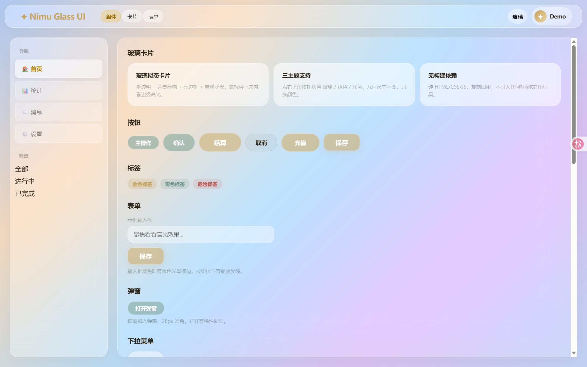
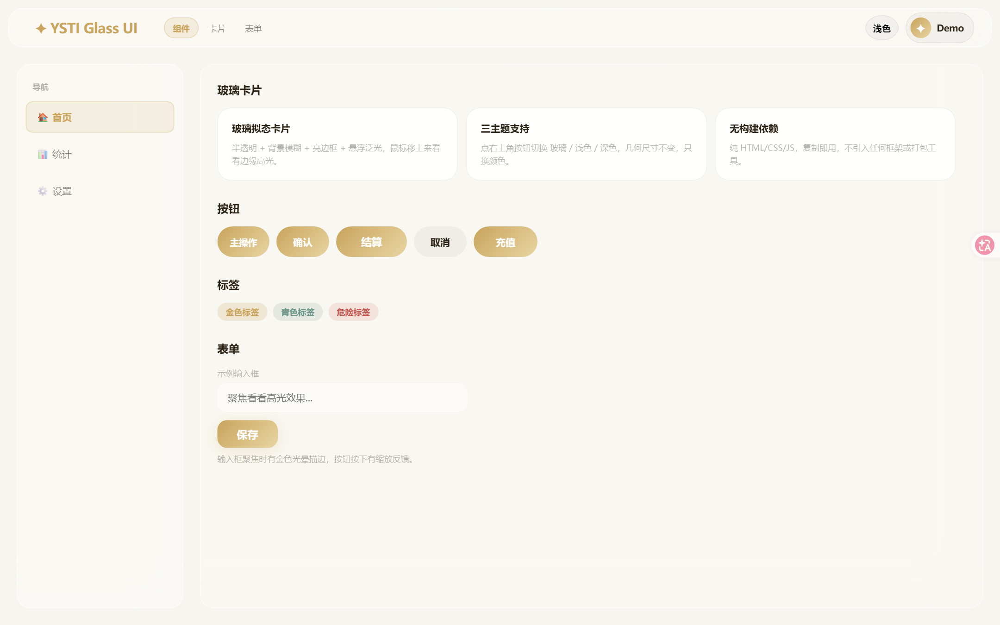
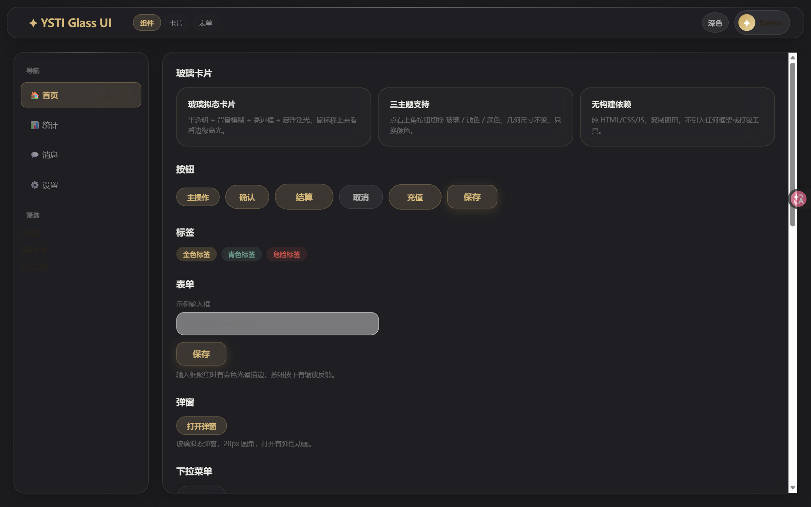

<div align="center">

# ✦ YSTI Glass UI

**一套精致的「三主题玻璃拟态」Web UI 体系**

纯 HTML / CSS / JS · 零构建依赖 · 复制即用

</div>

---

## 是什么

YSTI Glass UI 是一套**完整的 Web UI 体系**：玻璃拟态（Glassmorphism）+ 浅色 + 深色三主题一键切换，附带液态玻璃背景、光标泛光、玻璃边缘高光等特效。

它不是一个框架，而是一份**开箱即用的设计资产**：把 `ysti-glass.css` 引入你的页面，就能获得一整套打磨过的组件视觉——卡片、按钮、表单、弹窗、导航、侧边栏、登录页、消息气泡，全部自带三主题适配。

## 截图

| 玻璃拟态（默认） | 浅色 | 深色 |
|---|---|---|
|  |  |  |

## 特性

- ✨ **三主题体系**：玻璃拟态（默认）/ 浅色 / 深色，一键切换，几何尺寸恒定、只换颜色
- 🧊 **真·玻璃拟态**：半透明 + `backdrop-filter` 背景模糊 + 亮色描边 + 悬浮泛光
- 🎨 **液态玻璃背景**：`liquid-glass.js` — WebGL2 动态玻璃色块，鼠标跟随光晕（可关闭）
- 💫 **光标泛光 + 边缘高光**：鼠标经过玻璃板时边缘泛起高光（可关闭）
- 📱 **响应式**：桌面 / 移动端（≤820px）自适应，支持 `safe-area` 刘海屏
- 🚫 **零依赖**：不引入任何框架、UI 库、构建工具，纯原生三件套
- 🧩 **组件齐全**：卡片、按钮、标签、表单、弹窗、导航、侧边栏、登录页、聊天界面

## 在线演示

👉 [https://ystibdjmnm.github.io/ysti-glass-ui/](https://ystibdjmnm.github.io/ysti-glass-ui/)（GitHub Pages，配置方法见文末）

## 快速开始

### 方式一：直接看演示

```bash
# 任意静态服务器打开 index.html 即可（或直接双击）
python -m http.server 8080
# 浏览器访问 http://localhost:8080
```

点右上角按钮切换三主题；鼠标划过卡片看边缘高光；演示页包含卡片、按钮、标签、表单、弹窗、下拉菜单、聊天界面、登录页、列表等全部组件。

### 方式二：引入到你的项目

```html
<!-- 1. 引入核心样式 -->
<link rel="stylesheet" href="ysti-glass.css">

<!-- 2.（可选）液态玻璃背景特效 -->
<script src="liquid-glass.js"></script>

<!-- 3.（可选）光标泛光 + 玻璃边缘高光（见 index.html 内注释） -->
```

不需要任何初始化代码，样式开箱即用。

### 三主题切换

```html
<!-- 玻璃拟态（默认，无需类名） -->

<!-- 浅色 -->
<body class="light-mode">

<!-- 深色 -->
<body class="dark-mode">
```

主题按钮 + 持久化（localStorage）参考 `index.html` 末尾的 `themeToggle` 示例：

```js
var theme = localStorage.getItem("ysti_theme") || "glass";
// glass → light → dark 循环切换，写入 body class 与 localStorage
```

## 核心样式规范

### 圆角分级（重要约定）

| 层级 | 圆角 | 适用 |
|---|---|---|
| 容器 / 卡片 | `var(--radius)` = **20px** | 侧边栏、主内容、订单卡、会话项 |
| 弹窗 | **28px** | modal |
| 控件 | `var(--radius-sm)` = 14px | 输入框、按钮、select |
| 胶囊 | `var(--radius-pill)` = 100px | 标签、筛选、小按钮 |
| 消息气泡 | 14px | 聊天 |

### 玻璃样式

```css
background: rgba(255,255,255,.45);
backdrop-filter: blur(20px) saturate(1.5);
-webkit-backdrop-filter: blur(20px) saturate(1.5);
border: 1px solid rgba(255,255,255,.5);
border-radius: var(--radius);
box-shadow: 0 8px 32px rgba(0,0,0,.04), inset 0 1px 0 rgba(255,255,255,.5);
```

### 颜色变量

```css
--accent: #c8a45c;   /* 金色主色 */
--teal:   #6b9589;   /* 青色辅助 */
--danger: #c4554d;   /* 危险色 */
--text:   #2c2416;   /* 主文字 */
--bg:     #f7f5f0;   /* 背景 */
```

深色主题自动覆盖：背景 `#1c1c1e`、文字 `#e8e6e3`、accent `#d4b87a`。完整规范见 [`UI.md`](UI.md)。

## 示例与组件

| 文件 | 内容 |
|---|---|
| `index.html` | 三主题演示页（卡片/按钮/标签/表单/弹窗/下拉/聊天/登录/列表 + 全部特效） |
| `examples/console.html` | 完整「客服工作台」示例 ⚠️ **需要配套后端 API，不能纯静态打开**（作为完整应用参考） |
| `examples/widget.js` | 可嵌入任意网站的「聊天窗」小组件（一行代码接入，三主题自适应） |

> **GitHub Pages 开启方法**：仓库 Settings → Pages → Source 选 `Deploy from a branch` → Branch 选 `main` / `/ (root)` → Save，即可通过 `https://ystibdjmnm.github.io/ysti-glass-ui/` 访问在线演示。

## 目录结构

```
ysti-glass-ui/
├── assets/
│   ├── ysti-glass.css     # 核心样式（三主题体系，114KB）
│   └── liquid-glass.js    # WebGL2 液态玻璃背景特效
├── examples/
│   ├── console.html       # 客服工作台完整示例
│   └── widget.js          # 嵌入聊天窗小组件
├── screenshots/           # 三主题截图
├── index.html             # 三主题演示页
├── UI.md                  # 设计规范（圆角/颜色/玻璃样式/检查清单）
├── README.md              # 中文文档
├── README.en.md           # English docs
└── LICENSE
```

## 技术栈

- 原生 HTML / CSS / JavaScript（ES5 兼容写法）
- WebGL2（仅液态玻璃特效，可无痕降级：WebGL 不可用时自动跳过）
- 无任何 npm 依赖、无构建步骤

## 兼容性

- 现代浏览器（Chrome / Edge / Safari / Firefox）
- `backdrop-filter` 需较新版本浏览器；不支持时自动回退为纯色半透明
- 移动端适配完整（H5），支持 `env(safe-area-inset-*)`

## 许可证

[MIT](LICENSE) — 自由使用、修改、商用，保留版权声明即可。

---

<div align="center">

**如果这套 UI 对你有帮助，点个 ⭐ 支持一下**

</div>
